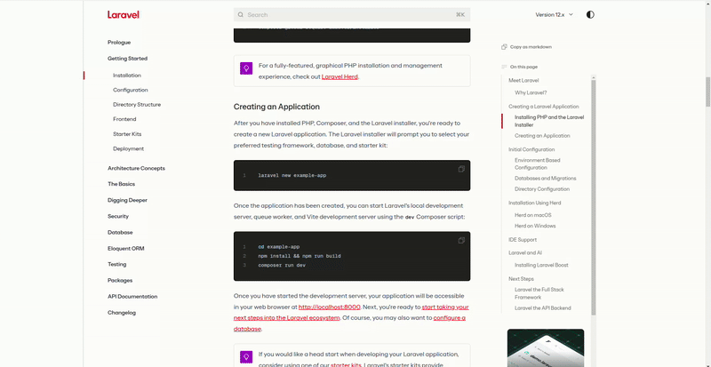

# SnapperX (Desktop Screenshot App)

SnapperX is a lightweight desktop app (similar to Xnapper) that makes taking and editing screenshots effortless.

## ✨ Features
- 📸 Capture screenshots instantly with a shortcut: **Ctrl + Shift + 4**
- ✏️ Redirects directly to an editor where you can crop, annotate, and highlight
- 💾 Save edited screenshots easily
- ⚡ Super fast and minimal — perfect for productivity

## 🎥 Demo

## 🚀 Usage
1. Press **Ctrl + Shift + 4** to take a screenshot  
2. The editor opens automatically  
3. Edit, annotate, and save your screenshot  

npm run electron:dev